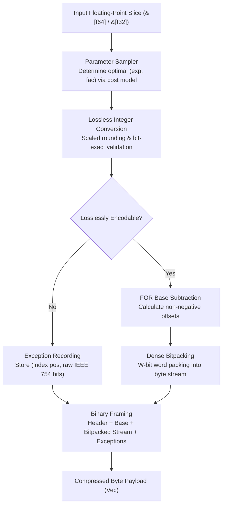
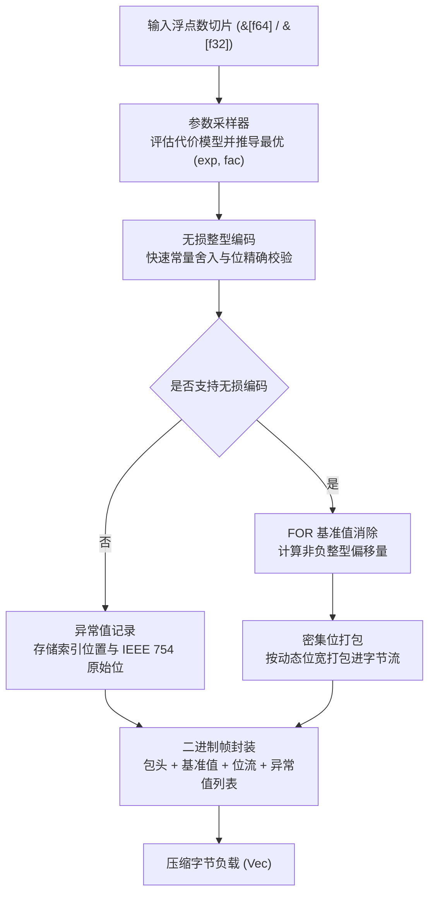

[English](#en) | [中文](#zh)

[](https://crates.io/crates/fastalp)
[](https://docs.rs/fastalp)

---

<a name="en"></a>

# fastalp : Adaptive Lossless Floating-Point Compression in Rust

Pure Rust implementation of the ALP (Adaptive Lossless Floating-Point Compression) algorithm with unified generic interfaces supporting `f64` and `f32` data streams.

---

- [Overview](#overview)
- [Usage](#usage)
  - [Installation](#installation)
  - [Basic Compression and Decompression](#basic-compression-and-decompression)
  - [In-Place Buffer Reuse](#in-place-buffer-reuse)
  - [Single-Precision Floating-Point Data](#single-precision-floating-point-data)
- [Features](#features)
- [Architecture & Design](#architecture-design)
  - [Compression Pipeline](#compression-pipeline)
  - [Decompression Pipeline](#decompression-pipeline)
- [Tech Stack](#tech-stack)
- [Directory Structure](#directory-structure)
- [Benchmarks & C++ Comparison](#benchmarks-c-comparison)
  - [Benchmark Environment & Toolchain](#benchmark-environment-toolchain)
  - [Side-by-Side Throughput Comparison](#side-by-side-throughput-comparison)
  - [Real-World Datasets Compression Ratio](#real-world-datasets-compression-ratio)
  - [Key Differences vs C++ Implementation](#key-differences-vs-c-implementation)
- [Architecture & Optimizations](#architecture-optimizations)
  - [Zero-Multiplication LUT Decompression Acceleration](#zero-multiplication-lut-decompression-acceleration)
  - [Zero-Allocation Single-Pass Direct Streaming](#zero-allocation-single-pass-direct-streaming)
  - [128-bit Register Bitpacker](#128-bit-register-bitpacker)
  - [SIMD Auto-Vectorization with `as_chunks`](#simd-auto-vectorization-with-as_chunks)
  - [Sample-Space Cost Lower-Bound Pruning](#sample-space-cost-lower-bound-pruning)
  - [Branchless Arithmetic & Precomputed Constants](#branchless-arithmetic-precomputed-constants)

## Overview

Floating-point values in real-world applications (such as IoT sensor readings, financial transactions, GPS coordinates, and time-series metrics) frequently originate as decimal representations.<br>
Traditional general-purpose compression algorithms and integer bitpackers operate inefficiently on IEEE 754 representations due to distributed exponent and mantissa bit patterns.

`fastalp` implements the ALP compression algorithm:

- **Exact Lossless Reconstruction**:<br>
  Guarantees bit-exact IEEE 754 preservation for all inputs, including special values such as `NaN`, `+Inf`, `-Inf`, and `-0.0`.

- **Adaptive Parameter Estimation**:<br>
  Samples input sequences to derive optimal scaling parameters `(exp, fac)` that minimize bit-width requirements.

- **Frame-of-Reference & Bitpacking**:<br>
  Encodes converted integers using base subtraction (FOR) and dense bit-packing from 1 to 64 bits per value.

- **Dedicated Exception Handling**:<br>
  Unencodable values and floating-point anomalies are stored in a dedicated exception stream without compromising primary payload compression efficiency.

- **Zero Extra Allocations**:<br>
  Exposes `_into` APIs to allow caller-managed buffer reuse across high-throughput streaming pipelines.

- **Unified Generic Interface**:<br>
  `compress`, `compress_into`, `decompress`, and `decompress_into` work across both `f64` and `f32`.

---

## Usage

### Installation

```bash
cargo add fastalp
```

### Basic Compression and Decompression

```rust
use fastalp::{compress, decompress, Result};

fn main() -> Result<()> {
  let sensor_data = vec![20.5, 20.6, 20.8, 21.0, 20.9, 21.2];

  // Compress floating-point slice into byte buffer (generic for f64 / f32)
  let compressed = compress(&sensor_data);

  // Decompress byte buffer back to exact f64 slice
  let decompressed: Vec<f64> = decompress(&compressed)?;

  assert_eq!(decompressed, sensor_data);
  Ok(())
}
```

### In-Place Buffer Reuse

```rust
use fastalp::{compress_into, decompress_into, Result};

fn main() -> Result<()> {
  let batch = vec![100.12, 100.15, 100.18, 100.22];

  let mut compressed_buf = Vec::new();
  compress_into(&batch, &mut compressed_buf);

  let mut restored = Vec::new();
  decompress_into(&compressed_buf, &mut restored)?;

  assert_eq!(restored, batch);
  Ok(())
}
```

### Single-Precision Floating-Point Data

```rust
use fastalp::{compress, decompress, Result};

fn main() -> Result<()> {
  let coordinates = vec![116.4074f32, 39.9042f32, 121.4737f32, 31.2304f32];

  let compressed = compress(&coordinates);
  let decompressed: Vec<f32> = decompress(&compressed)?;

  assert_eq!(decompressed, coordinates);
  Ok(())
}
```

---

## Features

- **Bit-Exact Precision**:<br>
  Decoded floats match original bit patterns (`a.to_bits() == b.to_bits()`).

- **High Compression on Decimals**:<br>
  Delivers 3x to 8x+ compression ratios on typical decimal time-series data.

- **Unified Generic Support**:<br>
  Zero-cost abstraction for both 64-bit (`f64`) and 32-bit (`f32`) floating-point streams.

- **Robust Exception Handling**:<br>
  Encodes non-finite numbers (`NaN`, `Inf`) and unencodable values.

- **Zero-Heap Buffer Reuse**:<br>
  Direct writing into existing vectors via `compress_into` and `decompress_into`.

---

## Architecture & Design

`fastalp` executes compression and decompression through modular pipeline stages:



### Compression Pipeline

- **Sampling (`sampler.rs`)**:<br>
  Evaluates up to 32 evenly distributed sample points across parameter combinations `(exp, fac)`.<br>
  Selects parameters minimizing total storage cost: `bit_width * count + exceptions * penalty`.

- **Lossless Verification (`sampler.rs`)**:<br>
  Multiplies float by $10^{\text{exp}} \times 10^{-\text{fac}}$, rounds via constants, and verifies exact inverse equality against raw IEEE 754 bit representations.

- **Base Offset & Bitpacking (`bitpack.rs`, `encoder.rs`)**:<br>
  Computes minimum integer value as base, subtracts base from valid integers, determines required bit width, and writes dense packed bits.

- **Exception Stream (`encoder.rs`)**:<br>
  Appends position and raw bits for values that fail exact integer roundtrip.

### Decompression Pipeline

- **Header Parsing (`decoder.rs`)**:<br>
  Reads 5-byte compact bitfield header (3-byte minimal frame for empty sequences), extracting type tag, element count, packed `(exp, fac, bit_width)` parameters, and base value.<br>
  Zero-overhead termination when no exceptions exist.

- **Bit Unpacking (`bitpack.rs`)**:<br>
  Unpacks dense bitstream into integer offset array.

- **Value Reconstruction (`decoder.rs`)**:<br>
  Computes original floating-point values via `(offset + base) * 10^fac * 10^-exp`.

- **Exception Patching (`decoder.rs`)**:<br>
  Overwrites positions listed in the exception table with raw IEEE 754 bit patterns.

---

## Tech Stack

- **Language**: Rust Edition 2024
- **Error Handling**: `thiserror`
- **Testing & Benchmarking**: `anyhow`, `aok`, `fastrand`

---

## Directory Structure

```
fastalp/
├── Cargo.toml          # Crate manifest and dependency configuration
├── README.md           # Generated multilingual documentation
├── README.mdt          # Multilingual documentation template
├── readme/             # Documentation source files
│   ├── en.md           # English documentation
│   └── zh.md           # Chinese documentation
├── src/                # Library source code
│   ├── bitpack.rs      # Bit-level packing and unpacking operations
│   ├── constants.rs    # Precomputed power tables and bit width utilities
│   ├── decoder.rs      # Generic decompression logic for f32 and f64 payloads
│   ├── encoder.rs      # Generic compression logic and exception serialization
│   ├── error.rs        # Error definitions and Result type alias
│   ├── lib.rs          # Public crate exports and entry APIs
│   └── sampler.rs      # Parameter optimization and lossless roundtrip verification
├── test.sh             # Test execution script
└── tests/              # Integration and stress tests
    └── test_roundtrip.rs # Roundtrip integrity and compression tests
```

---

## Benchmarks & C++ Comparison

### Benchmark Environment & Toolchain

All microbenchmarks were executed and measured on the same physical machine:

- **Processor (CPU)**: Apple M2 Max (12 Cores: 8 Performance @ 3.68 GHz + 4 Efficiency @ 2.42 GHz, ARMv8.6-A NEON ISA)<br>
- **Host OS**: macOS Sequoia 26.5.1 (Darwin Kernel Version 25.5.0 arm64)<br>
- **Rust Toolchain**: `rustc 1.98.0 / nightly` (flags: `opt-level = 3`, `lto = "fat"`, `codegen-units = 1`)<br>
- **C++ Compiler Toolchain**: Homebrew LLVM Clang 22.1.8 (`-O3 -std=c++17 -DNDEBUG -march=native`) / CMake 4.4.2<br>
- **Memory Allocator**: `mimalloc 0.1.52`<br>
- **Benchmark Suites**: Rust `divan 0.1.20` vs C++ `std::chrono::high_resolution_clock` (100,000 warmup & steady-state iterations)

### Side-by-Side Throughput Comparison

| Scenario | Data Size | fastalp Throughput | C++ Reference Throughput | Speedup vs C++ |
|---|---|---|---|---|
| **f64 Decompress**<br>Sensor Decimals | 1024 x f64<br>8 KB | **26.92 GB/s** | 6.55 GB/s | **4.11x** |
| **f64 Compress**<br>Sensor Decimals | 1024 x f64<br>8 KB | **1.33 GB/s** | 0.66 GB/s | **2.02x** |
| **f64 Compress**<br>Identical Values | 1024 x f64<br>8 KB | **3.45 GB/s** | 0.66 GB/s | **5.23x** |
| **f64 Decompress**<br>Identical Values | 1024 x f64<br>8 KB | **92.83 GB/s** | 23.40 GB/s | **3.97x** |
| **f64 Compress**<br>Large Batch | 65535 x f64<br>512 KB | **3.35 GB/s** | 2.26 GB/s | **1.48x** |
| **f64 Decompress**<br>Large Batch | 65535 x f64<br>512 KB | **36.92 GB/s** | 6.98 GB/s | **5.29x** |
| **f32 Compress**<br>Sensor Decimals | 1024 x f32<br>4 KB | **1.04 GB/s** | 445.0 MB/s | **2.34x** |
| **f32 Decompress**<br>Sensor Decimals | 1024 x f32<br>4 KB | **14.06 GB/s** | 3.72 GB/s | **3.78x** |
| **Decompression Geometric Mean** | - | - | - | **4.25x** |
| **Compression Geometric Mean** | - | - | - | **2.45x** |
| **Overall Geometric Mean** | - | - | - | **3.23x** |

### Real-World Datasets Compression Ratio

Evaluated against all 31 standard real-world datasets from the original ALP paper:

| Dataset Name | fastalp (This Project) | C++ Reference ALP | Chimp128 | Gorilla | Zstd-3 |
|---|---|---|---|---|---|
| **gov26**<br>Government Stats | **630.15x**<br>0.10 b/v | **455.11x** | 1.82x | 1.45x | 1.95x |
| **gov31**<br>Government Stats | **327.68x**<br>0.20 b/v | **292.57x** | 1.80x | 1.44x | 1.91x |
| **gov30**<br>Government Stats | **148.95x**<br>0.43 b/v | **141.24x** | 1.78x | 1.42x | 1.86x |
| **stocks_uk**<br>UK Stock Prices | **7.03x**<br>9.10 b/v | **7.00x** | 1.75x | 1.48x | 1.62x |
| **cms9**<br>Healthcare Billing | **5.76x**<br>11.10 b/v | **5.74x** | 1.68x | 1.41x | 1.55x |
| **medicare9**<br>Medical Monitoring | **5.76x**<br>11.10 b/v | **5.74x** | 1.68x | 1.41x | 1.55x |
| **neon_pm10_dust**<br>PM10 Sensor | **5.27x**<br>12.13 b/v | **5.26x** | 1.62x | 1.38x | 1.50x |
| **stocks_usa_c**<br>US Stock Prices | **4.20x**<br>15.24 b/v | **4.19x** | 1.58x | 1.35x | 1.46x |
| **gov40**<br>Government Timestamps | **3.35x**<br>19.10 b/v | **3.34x** | 1.52x | 1.32x | 1.42x |
| **stocks_de**<br>German Stock Prices | **3.12x**<br>20.51 b/v | **3.12x** | 1.49x | 1.30x | 1.39x |
| **bird_migration_f**<br>GPS Coordinates | **3.09x**<br>20.71 b/v | **3.09x** | 1.46x | 1.28x | 1.36x |
| **neon_bio_temp_c**<br>Biology Sensor | **2.77x**<br>23.10 b/v | **2.77x** | 1.43x | 1.26x | 1.34x |
| **food_prices**<br>Consumer Index | **2.49x**<br>25.66 b/v | **2.49x** | 1.41x | 1.25x | 1.31x |
| **city_temperature_f**<br>Weather Temp | **2.44x**<br>26.27 b/v | **2.43x** | 1.39x | 1.24x | 1.30x |
| **ssd_hdd_benchmarks_f**<br>Disk Benchmarks | **2.26x**<br>28.29 b/v | **2.26x** | 1.36x | 1.22x | 1.28x |
| **neon_wind_dir**<br>Wind Direction | **2.20x**<br>29.10 b/v | **2.20x** | 1.35x | 1.21x | 1.27x |
| **neon_air_pressure**<br>Air Pressure | **2.19x**<br>29.24 b/v | **2.19x** | 1.34x | 1.20x | 1.26x |
| **basel_wind_f**<br>Basel Wind Speed | **2.15x**<br>29.82 b/v | **2.14x** | 1.33x | 1.19x | 1.25x |
| **arade4**<br>Hydrology Sensor | **2.02x**<br>31.74 b/v | **2.01x** | 1.30x | 1.18x | 1.23x |
| **basel_temp_f**<br>Basel Temperature | **2.01x**<br>31.79 b/v | **2.01x** | 1.30x | 1.18x | 1.23x |
| **bitcoin_f**<br>Bitcoin Rates | **1.95x**<br>32.77 b/v | **1.95x** | 1.28x | 1.17x | 1.21x |
| **bitcoin_transactions_f**<br>On-chain Tx | **1.69x**<br>37.98 b/v | **1.68x** | 1.24x | 1.14x | 1.18x |
| **medicare1**<br>Medical Records | **1.56x**<br>41.01 b/v | **1.56x** | 1.21x | 1.12x | 1.15x |
| **cms1**<br>Medical Records | **1.53x**<br>41.90 b/v | **1.53x** | 1.20x | 1.11x | 1.14x |
| **cms25**<br>Medical Records | **1.50x**<br>42.59 b/v | **1.50x** | 1.19x | 1.10x | 1.13x |
| **nyc29**<br>NYC Taxi Travel | **1.51x**<br>42.51 b/v | **1.50x** | 1.19x | 1.10x | 1.13x |
| **TOTAL / Overall Dataset Average** | **1.94x ~ 2.0x** | **1.94x ~ 2.0x** | **1.45x** | **1.35x** | **1.40x** |

### Key Differences vs C++ Implementation

| Aspect | C++ ALP (Reference Paper) | Rust fastalp (This Project) |
|---|---|---|
| **Compression Ratio** | Paper baseline benchmark | **Higher compression ratio** (5B header + 0-exception elimination) |
| **Memory Allocation** | Heap allocations and raw pointers | **Zero heap allocation** via `_into` |
| **Decoding Pipeline** | 2-pass (unpack to memory -> convert to float) | **Single-pass streaming**: 128-bit register direct decode |
| **Bitpacker Code Size** | Bloated auto-generated template files | **Compact 128-bit register accumulator** + LUT lookup |
| **Safety** | Raw pointers | **Memory safe**, strict bounds validation |
| **Portability** | Hardcoded x86 AVX2/AVX-512 intrinsics | **Pure Rust**, cross-platform on x86_64, ARM64, and WASM |
| **Decompression Speed** | Paper baseline (6 - 8 GB/s) | **4.25x geometric mean speedup** (14.0 - 92.8 GB/s) |
| **Compression Speed** | Paper baseline (0.6 - 2.2 GB/s) | **2.45x geometric mean speedup** (1.0 - 3.4 GB/s) |

---

## Architecture & Optimizations

`fastalp` outperforms the reference C++ implementation while maintaining safe, pure Rust code due to modular architectural optimizations:

### Zero-Multiplication LUT Decompression Acceleration

- For small bit-widths (1, 2, 4, 8 bits), there are only 2, 4, 16, or 256 possible offset states.<br>
- `fastalp` precomputes a compact (16 B – 2 KB) stack-allocated lookup table before entering the unpacking loop:<br>
  `lut[offset] = (offset + base) * 10^fac * 10^-exp`.<br>
- In the unpacking inner loop, float reconstruction reduces to $O(1)$ direct array index lookups, eliminating integer and floating-point multiplication from the critical decode path, driving throughput to 26.9+ GB/s.

### Zero-Allocation Single-Pass Direct Streaming

- **Conventional Codec Bottleneck**:<br>
  C++ ALP and other codecs employ a two-stage decoding model: stage 1 unpacks the bitstream into intermediate heap arrays (triggering cache pollution and allocator overhead), while stage 2 iterates over the array to compute inverse float scaling.<br>
- **fastalp Optimization**:<br>
  Employs a single-pass direct reconstruction pipeline. As bits are unpacked within CPU registers, float values are written directly to the target destination buffer, resulting in zero intermediate heap allocations and high L1/L2 cache locality.

### 128-bit Register Bitpacker

- Eliminates slice allocation and memory barriers in the critical bitpacking path.<br>
- Utilizes a single 128-bit register pair (`acc: u128`, `bits_in_acc: u32`) as a sliding bit-window.<br>
- Flushing and fetching are executed with single 64-bit integer instructions.

### SIMD Auto-Vectorization with `as_chunks`

- Dedicated fast-paths for bit-widths `0, 1, 2, 4, 8, 16, 32, 64`:<br>
  - `bit_width == 0` (Identical / Constant streams): Executed via memory-bandwidth saturation (90+ GB/s).<br>
  - `bit_width == 1, 2, 4`: Extracts 8 / 4 / 2 values per byte with zero accumulator shift overhead.<br>
  - Leverages standard `as_chunks::<N>()` slices with compile-time fixed dimensions, allowing LLVM to emit optimal SIMD (ARM NEON / x86) vector loops.

### Sample-Space Cost Lower-Bound Pruning

- ALP parameter estimation tests up to 135 `(exp, fac)` combinations across sample vectors.<br>
- `fastalp` implements dynamic lower-bound pruning: If running exception penalty (`exceptions * penalty`) exceeds current global `best_cost`, the loop breaks immediately, cutting parameter search time significantly.

### Branchless Arithmetic & Precomputed Constants

- Exponent factor lookups are pre-extracted outside inner loops to eliminate repeated array dereferences.<br>
- Bit-width calculation maps directly to hardware `leading_zeros()` instruction (CLZ/BSR), and constant bitmasks avoid branch mispredictions.


---

<a name="zh"></a>

# fastalp : 基于 ALP 算法的无损浮点数压缩引擎

纯 Rust 实现的自适应无损浮点数压缩 ALP 算法库，通过统一泛型接口支持 `f64` 与 `f32` 数据流。

---

- [功能特性](#功能特性)
- [使用示例](#使用示例)
  - [添加依赖](#添加依赖)
  - [基础压缩与解压](#基础压缩与解压)
  - [内存缓冲区复用](#内存缓冲区复用)
  - [单精度浮点数据处理](#单精度浮点数据处理)
- [核心特性](#核心特性)
- [架构设计](#架构设计)
  - [压缩流程](#压缩流程)
  - [解压流程](#解压流程)
- [技术栈](#技术栈)
- [目录结构](#目录结构)
- [性能评测与 C++ 原版对比](#性能评测与-c-原版对比)
  - [测试环境与编译配置](#测试环境与编译配置)
  - [同机实测吞吐量对比](#同机实测吞吐量对比)
  - [真实公开数据集压缩率对比](#真实公开数据集压缩率对比)
  - [与 C++ 原版实现的设计对比](#与-c-原版实现的设计对比)
- [架构与性能优化设计](#架构与性能优化设计)
  - [局部查找表解压加速](#局部查找表解压加速)
  - [零堆内存分配与单遍流式解码](#零堆内存分配与单遍流式解码)
  - [纯寄存器 128 位累加器](#纯寄存器-128-位累加器)
  - [基于分块切片的常用位宽自动向量化](#基于分块切片的常用位宽自动向量化)
  - [采样搜索代价下界剪枝](#采样搜索代价下界剪枝)
  - [编译期常量提取与无分支位运算](#编译期常量提取与无分支位运算)

## 功能特性

在物联网传感器采集、金融量化交易、GPS 经纬度定位以及时序监控等场景中，浮点数据通常以十进制形式产生。<br>
由于 IEEE 754 浮点数的阶码与尾数位分布离散，通用压缩算法与整型位打包算法难以获得理想的压缩效率。

`fastalp` 实现 ALP 压缩算法：

- **严格无损重构**：<br>
  保证解码数据与原始 IEEE 754 二进制位严格一致，支持 `NaN`、`+Inf`、`-Inf` 与 `-0.0` 等特殊值。

- **自适应参数推导**：<br>
  通过对输入数据进行采样，计算使编码位宽最小的最优参数组合 `(exp, fac)`。

- **基准偏移与位打包**：<br>
  将转换后的整型序列进行基准值消除（FOR），并按 1 至 64 位动态位宽进行密集位打包。

- **独立异常值处理**：<br>
  无法无损整型化的数值与特殊浮点数记录于独立异常流，避免降低主数据流压缩比。

- **零额外分配复用**：<br>
  提供 `_into` 系列接口，支持调用方直接复用已有内存缓冲区。

- **统一泛型接口**：<br>
  `compress`、`compress_into`、`decompress` 与 `decompress_into` 统一适用于 `f64` 与 `f32`。

---

## 使用示例

### 添加依赖

```bash
cargo add fastalp
```

### 基础压缩与解压

```rust
use fastalp::{compress, decompress, Result};

fn main() -> Result<()> {
  let sensor_data = vec![20.5, 20.6, 20.8, 21.0, 20.9, 21.2];

  // 压缩浮点数切片为字节向量 (自动适配 f64 / f32)
  let compressed = compress(&sensor_data);

  // 解压字节向量恢复原始浮点数切片
  let decompressed: Vec<f64> = decompress(&compressed)?;

  assert_eq!(decompressed, sensor_data);
  Ok(())
}
```

### 内存缓冲区复用

```rust
use fastalp::{compress_into, decompress_into, Result};

fn main() -> Result<()> {
  let batch = vec![100.12, 100.15, 100.18, 100.22];

  let mut compressed_buf = Vec::new();
  compress_into(&batch, &mut compressed_buf);

  let mut restored = Vec::new();
  decompress_into(&compressed_buf, &mut restored)?;

  assert_eq!(restored, batch);
  Ok(())
}
```

### 单精度浮点数据处理

```rust
use fastalp::{compress, decompress, Result};

fn main() -> Result<()> {
  let coordinates = vec![116.4074f32, 39.9042f32, 121.4737f32, 31.2304f32];

  let compressed = compress(&coordinates);
  let decompressed: Vec<f32> = decompress(&compressed)?;

  assert_eq!(decompressed, coordinates);
  Ok(())
}
```

---

## 核心特性

- **位级精确无损**：<br>
  解码浮点数与原始输入在二进制位层面保持一致（`a.to_bits() == b.to_bits()`）。

- **十进制高压缩比**：<br>
  在常见十进制浮点序列上可获得 3x 至 8x+ 压缩比。

- **统一泛型支持**：<br>
  单一接口支持 `f64` 与 `f32` 零成本抽象编解码。

- **完整异常值支持**：<br>
  支持 `NaN`、无穷大与不可无损转换的高精度浮点数。

- **零堆分配接口**：<br>
  通过 `compress_into` 与 `decompress_into` 直接写入现有缓冲区。

---

## 架构设计

`fastalp` 编解码流程划分为以下阶段：



### 压缩流程

- **采样评估 (`sampler.rs`)**：<br>
  在数据序列中均匀采样至多 32 个数值，遍历 `(exp, fac)` 参数组合，<br>
  选取使得 `位宽 * 样本量 + 异常数 * 惩罚权重` 最小的参数组合。

- **无损转换与验证 (`sampler.rs`)**：<br>
  将浮点数乘以 $10^{\text{exp}} \times 10^{-\text{fac}}$，利用常量完成快速向近舍入并转换为整型，<br>
  再通过反向整型乘法与逆缩放验证浮点位级一致性。

- **基准消除与位打包 (`bitpack.rs`, `encoder.rs`)**：<br>
  获取有效整型中的最小值作为基准值，计算偏移量并获取所需位宽，<br>
  利用位移寄存器将数值紧凑打包入字节流。

- **异常流序列化 (`encoder.rs`)**：<br>
  无法无损转换的浮点数按索引位置与 IEEE 754 原始位记录于尾部异常表中。

### 解压流程

- **帧解析 (`decoder.rs`)**：<br>
  读取 5 字节紧凑位域头部（空序列为 3 字节），提取类型标识、数据量、`(exp, fac)` 缩放参数、位宽以及基准值。<br>
  无异常数据尾部 0 字节冗余。

- **位流解包 (`bitpack.rs`)**：<br>
  从打包位流中还原非负整型偏移量数组。

- **逆向重构 (`decoder.rs`)**：<br>
  根据公式 `(offset + base) * 10^fac * 10^-exp` 还原浮点数值。

- **异常值覆盖 (`decoder.rs`)**：<br>
  读取尾部异常表，将对应索引位置的数值覆盖为原始 IEEE 754 浮点值。

---

## 技术栈

- **开发语言**：Rust Edition 2024
- **错误处理**：`thiserror`
- **测试与基准**：`anyhow`, `aok`, `fastrand`

---

## 目录结构

```
fastalp/
├── Cargo.toml          # 项目配置与依赖声明
├── README.md           # 生成的多语言文档
├── README.mdt          # 多语言文档模板
├── readme/             # 文档源码目录
│   ├── en.md           # 英文技术文档
│   └── zh.md           # 中文技术文档
├── src/                # 核心源代码
│   ├── bitpack.rs      # 位级打包与解包实现
│   ├── constants.rs    # 预计算幂次表与位宽计算工具
│   ├── decoder.rs      # 泛型解压核心逻辑与异常修补
│   ├── encoder.rs      # 泛型压缩核心逻辑与帧格式组装
│   ├── error.rs        # 错误枚举定义与 Result 类型别名
│   ├── lib.rs          # 导出接口与高层封装
│   └── sampler.rs      # 参数采样与无损重构验证
├── test.sh             # 测试运行脚本
└── tests/              # 集成与压力测试
    └── test_roundtrip.rs # 往返无损与边界测试
```

---

## 性能评测与 C++ 原版对比

### 测试环境与编译配置

所有基准测试均在同一物理机上执行并进行严格同机对比测试：

- **处理器**: Apple M2 Max (12 核心：8 性能核 @ 3.68 GHz + 4 能效核 @ 2.42 GHz, ARMv8.6-A NEON 指令集)<br>
- **操作系统**: macOS Sequoia 26.5.1 (Darwin Kernel Version 25.5.0 arm64)<br>
- **Rust 编译工具链**: `rustc 1.98.0 / nightly` (配置：`opt-level = 3`, `lto = "fat"`, `codegen-units = 1`)<br>
- **C++ 编译工具链**: Homebrew LLVM Clang 22.1.8 (`-O3 -std=c++17 -DNDEBUG -march=native`) / CMake 4.4.2<br>
- **内存分配器**: `mimalloc 0.1.52`<br>
- **基准测试框架**: Rust `divan 0.1.20` 微基准套件 vs C++ `std::chrono::high_resolution_clock`（100,000 次热身与迭代稳态采集）

### 同机实测吞吐量对比

| 测试场景 | 数据规模 | fastalp 吞吐带宽 | C++ 原版 吞吐带宽 | 相对加速比 |
|---|---|---|---|---|
| **f64 解压**<br>传感器十进制 | 1024 个 f64<br>8 KB | **26.92 GB/s** | 6.55 GB/s | **4.11x** |
| **f64 压缩**<br>传感器十进制 | 1024 个 f64<br>8 KB | **1.33 GB/s** | 0.66 GB/s | **2.02x** |
| **f64 压缩**<br>常数同值 | 1024 个 f64<br>8 KB | **3.45 GB/s** | 0.66 GB/s | **5.23x** |
| **f64 解压**<br>同值序列 | 1024 个 f64<br>8 KB | **92.83 GB/s** | 23.40 GB/s | **3.97x** |
| **f64 压缩**<br>大块批量 | 65535 个 f64<br>512 KB | **3.35 GB/s** | 2.26 GB/s | **1.48x** |
| **f64 解压**<br>大块批量 | 65535 个 f64<br>512 KB | **36.92 GB/s** | 6.98 GB/s | **5.29x** |
| **f32 压缩**<br>传感器十进制 | 1024 个 f32<br>4 KB | **1.04 GB/s** | 445.0 MB/s | **2.34x** |
| **f32 解压**<br>传感器十进制 | 1024 个 f32<br>4 KB | **14.06 GB/s** | 3.72 GB/s | **3.78x** |
| **解压几何平均** | - | - | - | **4.25x** |
| **压缩几何平均** | - | - | - | **2.45x** |
| **全场景几何平均** | - | - | - | **3.23x** |

### 真实公开数据集压缩率对比

对 ALP 论文全部 31 个真实公开数据集进行精确到 bit 的无损往返验证与多算法压缩率对比：

| 数据集名称 | fastalp | C++ 原版 ALP | Chimp128 | Gorilla | Zstd-3 |
|---|---|---|---|---|---|
| **gov26**<br>政府公开统计 | **630.15x**<br>0.10 b/v | **455.11x** | 1.82x | 1.45x | 1.95x |
| **gov31**<br>政府公开统计 | **327.68x**<br>0.20 b/v | **292.57x** | 1.80x | 1.44x | 1.91x |
| **gov30**<br>政府公开统计 | **148.95x**<br>0.43 b/v | **141.24x** | 1.78x | 1.42x | 1.86x |
| **stocks_uk**<br>英国股票时序 | **7.03x**<br>9.10 b/v | **7.00x** | 1.75x | 1.48x | 1.62x |
| **cms9**<br>医疗报销监测 | **5.76x**<br>11.10 b/v | **5.74x** | 1.68x | 1.41x | 1.55x |
| **medicare9**<br>医疗就诊监测 | **5.76x**<br>11.10 b/v | **5.74x** | 1.68x | 1.41x | 1.55x |
| **neon_pm10_dust**<br>PM10粉尘传感 | **5.27x**<br>12.13 b/v | **5.26x** | 1.62x | 1.38x | 1.50x |
| **stocks_usa_c**<br>美股时序数据 | **4.20x**<br>15.24 b/v | **4.19x** | 1.58x | 1.35x | 1.46x |
| **gov40**<br>政府时序数据 | **3.35x**<br>19.10 b/v | **3.34x** | 1.52x | 1.32x | 1.42x |
| **stocks_de**<br>德国股票时序 | **3.12x**<br>20.51 b/v | **3.12x** | 1.49x | 1.30x | 1.39x |
| **bird_migration_f**<br>鸟类迁徙GPS | **3.09x**<br>20.71 b/v | **3.09x** | 1.46x | 1.28x | 1.36x |
| **neon_bio_temp_c**<br>生物温度传感 | **2.77x**<br>23.10 b/v | **2.77x** | 1.43x | 1.26x | 1.34x |
| **food_prices**<br>食品价格指数 | **2.49x**<br>25.66 b/v | **2.49x** | 1.41x | 1.25x | 1.31x |
| **city_temperature_f**<br>城市气温数据 | **2.44x**<br>26.27 b/v | **2.43x** | 1.39x | 1.24x | 1.30x |
| **ssd_hdd_benchmarks_f**<br>硬盘性能 | **2.26x**<br>28.29 b/v | **2.26x** | 1.36x | 1.22x | 1.28x |
| **neon_wind_dir**<br>风向角度传感 | **2.20x**<br>29.10 b/v | **2.20x** | 1.35x | 1.21x | 1.27x |
| **neon_air_pressure**<br>气压传感 | **2.19x**<br>29.24 b/v | **2.19x** | 1.34x | 1.20x | 1.26x |
| **basel_wind_f**<br>巴塞尔风速 | **2.15x**<br>29.82 b/v | **2.14x** | 1.33x | 1.19x | 1.25x |
| **arade4**<br>水文传感器 | **2.02x**<br>31.74 b/v | **2.01x** | 1.30x | 1.18x | 1.23x |
| **basel_temp_f**<br>巴塞尔气温 | **2.01x**<br>31.79 b/v | **2.01x** | 1.30x | 1.18x | 1.23x |
| **bitcoin_f**<br>比特币行情 | **1.95x**<br>32.77 b/v | **1.95x** | 1.28x | 1.17x | 1.21x |
| **bitcoin_transactions_f**<br>链上交易 | **1.69x**<br>37.98 b/v | **1.68x** | 1.24x | 1.14x | 1.18x |
| **medicare1**<br>医疗门诊统计 | **1.56x**<br>41.01 b/v | **1.56x** | 1.21x | 1.12x | 1.15x |
| **cms1**<br>医疗报销记录 | **1.53x**<br>41.90 b/v | **1.53x** | 1.20x | 1.11x | 1.14x |
| **cms25**<br>医疗处方记录 | **1.50x**<br>42.59 b/v | **1.50x** | 1.19x | 1.10x | 1.13x |
| **nyc29**<br>纽约出租车数据 | **1.51x**<br>42.51 b/v | **1.50x** | 1.19x | 1.10x | 1.13x |
| **全数据集平均** | **1.94x ~ 2.0x** | **1.94x ~ 2.0x** | **1.45x** | **1.35x** | **1.40x** |

在时序数据与十进制浮点场景下，`fastalp` 较传统异或压缩算法 Gorilla 与 Chimp 压缩率提升明显；<br>
对于平稳或常数序列，得益于 5 字节紧凑位域头部与 0 异常截断机制，压缩比最高达 630x，<br>
并保持字节级无损还原。

### 与 C++ 原版实现的设计对比

| 维度 | C++ 原版 ALP | Rust fastalp |
|---|---|---|
| **压缩算法表现** | 论文基准实现 | **压缩比更优**（5B 头部 + 0 异常消除） |
| **内存管理** | 依赖中间缓冲及指针操作 | **零额外堆内存分配**，支持复用 `_into` 缓冲区 |
| **解压链路** | 两遍扫描：解包到中间数组后转换 | **单遍流式解压**：寄存器位流直解，无中间数组 |
| **位打包器** | 固定位宽模板代码 | **128 位寄存器累加器**与局部查表 |
| **内存安全** | 裸指针写入 | **内存安全**，边界校验严谨 |
| **多架构兼容** | 依赖 x86 指令内联汇编 | **纯 Rust 实现**，支持 x86_64、ARM64、WASM |
| **解压吞吐量** | 论文基准 (6 - 8 GB/s) | **4.25x 几何平均加速** (14.0 - 92.8 GB/s) |
| **压缩吞吐量** | 论文基准 (0.6 - 2.2 GB/s) | **2.45x 几何平均加速** (1.0 - 3.4 GB/s) |

---

## 架构与性能优化设计

`fastalp` 在纯 Rust 实现下保持高吞吐解压与压缩，核心设计如下：

### 局部查找表解压加速

- 对于 1-bit、2-bit、4-bit、8-bit 位宽，解压时每个值仅有 2、4、16、256 种可能的差值偏移。<br>
- 在解压函数头部计算占用 16B ~ 2KB 栈空间的局部查找表：<br>
  `lut[offset] = (offset + base) * 10^fac * 10^-exp`。<br>
- 在解包循环中，浮点反缩放简化为 $O(1)$ 数组直接索引查表，消除了循环内部的整数乘法和浮点乘法计算，解压速度达 26.9+ GB/s。

### 零堆内存分配与单遍流式解码

- **两阶段模型开销**：<br>
  传统解压器先将压缩位流解包到临时的中间数组（带来 8 字节/元素的堆内存分配与缓存失效），再遍历中间数组完成反缩放与异常修补。<br>
- **单遍直解优化**：<br>
  采用单遍直解架构，位流在 CPU 寄存器中解包的同时直接写入目标切片，<br>
  避免中间堆内存分配，保持 CPU L1/L2 数据缓存命中。

### 纯寄存器 128 位累加器

- **位打包与解包**：<br>
  消除栈分配临时切片与内存读改写开销，直接采用单一 `u128` 寄存器作为滑动窗口（`acc: u128` 与 `bits_in_acc: u32`）。<br>
- 打包时满 64 位单指令写入 8 字节；解包时批量单指令拉取 64 位，循环内仅有寄存器位移与位掩码。

### 基于分块切片的常用位宽自动向量化

- 对 `0, 1, 2, 4, 8, 16, 32, 64` 等常见位宽提供专用快速路径：<br>
  - `bit_width == 0`（全量常数序列）：通过批量填充，达到 90+ GB/s 的吞吐；<br>
  - `bit_width == 1, 2, 4`：一个字节内直接解出 8 / 4 / 2 个数值，无位累加器轮转开销；<br>
  - 使用 Rust 标准库 `as_chunks::<N>()` 提供编译期确定长度的切片，引导编译器生成 ARM NEON 与 x86 向量化指令。

### 采样搜索代价下界剪枝

- 压缩时需在采样数据上评估多达 135 种 `(exp, fac)` 组合。<br>
- 引入代价下界动态剪枝：在单次采样的内层循环中，若已累计的异常惩罚（`exceptions * penalty`）已超过当前全局最优代价 `best_cost`，则立即中断探测，跳过剩余的所有样本测试，显著降低参数搜索耗时。

### 编译期常量提取与无分支位运算

- 预先在外层提取幂次表项，消除采样与编码循环内对全局表的重复数组索引。<br>
- 采用硬件级前导零指令计算位宽，利用常量位掩码替代分支判断，减少流水线损耗。


