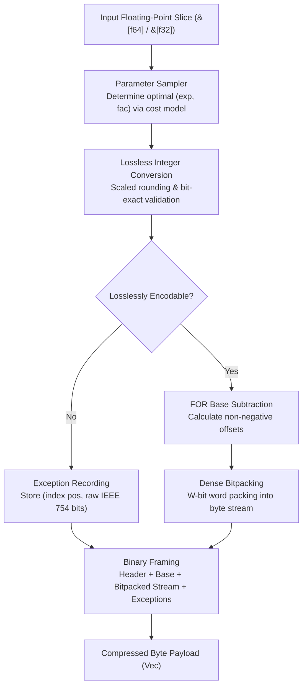

# fastalp : Adaptive Lossless Floating-Point Compression in Rust

Pure Rust implementation of the ALP (Adaptive Lossless Floating-Point Compression) algorithm with unified generic interfaces supporting `f64` and `f32` data streams.

---

## Overview

Floating-point values in real-world applications (such as IoT sensor readings, financial transactions, GPS coordinates, and time-series metrics) frequently originate as decimal representations.<br>
Traditional general-purpose compression algorithms and integer bitpackers operate inefficiently on IEEE 754 representations due to distributed exponent and mantissa bit patterns.

`fastalp` implements the ALP compression algorithm:

- **Exact Lossless Reconstruction**:<br>
  Guarantees bit-exact IEEE 754 preservation for all inputs, including special values such as `NaN`, `+Inf`, `-Inf`, and `-0.0`.

- **Adaptive Parameter Estimation**:<br>
  Samples input sequences to derive optimal scaling parameters `(exp, fac)` that minimize bit-width requirements.

- **Frame-of-Reference & Bitpacking**:<br>
  Encodes converted integers using base subtraction (FOR) and dense bit-packing from 1 to 64 bits per value.

- **Dedicated Exception Handling**:<br>
  Unencodable values and floating-point anomalies are stored in a dedicated exception stream without compromising primary payload compression efficiency.

- **Zero Extra Allocations**:<br>
  Exposes `_into` APIs to allow caller-managed buffer reuse across high-throughput streaming pipelines.

- **Unified Generic Interface**:<br>
  `compress`, `compress_into`, `decompress`, and `decompress_into` work across both `f64` and `f32`.

---

## Usage

### Installation

```bash
cargo add fastalp
```

### Basic Compression and Decompression

```rust
use fastalp::{compress, decompress, Result};

fn main() -> Result<()> {
  let sensor_data = vec![20.5, 20.6, 20.8, 21.0, 20.9, 21.2];

  // Compress floating-point slice into byte buffer (generic for f64 / f32)
  let compressed = compress(&sensor_data);

  // Decompress byte buffer back to exact f64 slice
  let decompressed: Vec<f64> = decompress(&compressed)?;

  assert_eq!(decompressed, sensor_data);
  Ok(())
}
```

### In-Place Buffer Reuse

```rust
use fastalp::{compress_into, decompress_into, Result};

fn main() -> Result<()> {
  let batch = vec![100.12, 100.15, 100.18, 100.22];

  let mut compressed_buf = Vec::new();
  compress_into(&batch, &mut compressed_buf);

  let mut restored = Vec::new();
  decompress_into(&compressed_buf, &mut restored)?;

  assert_eq!(restored, batch);
  Ok(())
}
```

### Single-Precision Floating-Point Data

```rust
use fastalp::{compress, decompress, Result};

fn main() -> Result<()> {
  let coordinates = vec![116.4074f32, 39.9042f32, 121.4737f32, 31.2304f32];

  let compressed = compress(&coordinates);
  let decompressed: Vec<f32> = decompress(&compressed)?;

  assert_eq!(decompressed, coordinates);
  Ok(())
}
```

---

## Features

- **Bit-Exact Precision**:<br>
  Decoded floats match original bit patterns (`a.to_bits() == b.to_bits()`).

- **High Compression on Decimals**:<br>
  Delivers 3x to 8x+ compression ratios on typical decimal time-series data.

- **Unified Generic Support**:<br>
  Zero-cost abstraction for both 64-bit (`f64`) and 32-bit (`f32`) floating-point streams.

- **Robust Exception Handling**:<br>
  Encodes non-finite numbers (`NaN`, `Inf`) and unencodable values.

- **Zero-Heap Buffer Reuse**:<br>
  Direct writing into existing vectors via `compress_into` and `decompress_into`.

---

## Architecture & Design

`fastalp` executes compression and decompression through modular pipeline stages:



### Compression Pipeline

- **Sampling (`sampler.rs`)**:<br>
  Evaluates up to 32 evenly distributed sample points across parameter combinations `(exp, fac)`.<br>
  Selects parameters minimizing total storage cost: `bit_width * count + exceptions * penalty`.

- **Lossless Verification (`sampler.rs`)**:<br>
  Multiplies float by $10^{\text{exp}} \times 10^{-\text{fac}}$, rounds via constants, and verifies exact inverse equality against raw IEEE 754 bit representations.

- **Base Offset & Bitpacking (`bitpack.rs`, `encoder.rs`)**:<br>
  Computes minimum integer value as base, subtracts base from valid integers, determines required bit width, and writes dense packed bits.

- **Exception Stream (`encoder.rs`)**:<br>
  Appends position and raw bits for values that fail exact integer roundtrip.

### Decompression Pipeline

- **Header Parsing (`decoder.rs`)**:<br>
  Reads 5-byte compact bitfield header (3-byte minimal frame for empty sequences), extracting type tag, element count, packed `(exp, fac, bit_width)` parameters, and base value.<br>
  Zero-overhead termination when no exceptions exist.

- **Bit Unpacking (`bitpack.rs`)**:<br>
  Unpacks dense bitstream into integer offset array.

- **Value Reconstruction (`decoder.rs`)**:<br>
  Computes original floating-point values via `(offset + base) * 10^fac * 10^-exp`.

- **Exception Patching (`decoder.rs`)**:<br>
  Overwrites positions listed in the exception table with raw IEEE 754 bit patterns.

---

## Tech Stack

- **Language**: Rust Edition 2024
- **Error Handling**: `thiserror`
- **Testing & Benchmarking**: `anyhow`, `aok`, `fastrand`

---

## Directory Structure

```
fastalp/
├── Cargo.toml          # Crate manifest and dependency configuration
├── README.md           # Generated multilingual documentation
├── README.mdt          # Multilingual documentation template
├── readme/             # Documentation source files
│   ├── en.md           # English documentation
│   └── zh.md           # Chinese documentation
├── src/                # Library source code
│   ├── bitpack.rs      # Bit-level packing and unpacking operations
│   ├── constants.rs    # Precomputed power tables and bit width utilities
│   ├── decoder.rs      # Generic decompression logic for f32 and f64 payloads
│   ├── encoder.rs      # Generic compression logic and exception serialization
│   ├── error.rs        # Error definitions and Result type alias
│   ├── lib.rs          # Public crate exports and entry APIs
│   └── sampler.rs      # Parameter optimization and lossless roundtrip verification
├── test.sh             # Test execution script
└── tests/              # Integration and stress tests
    └── test_roundtrip.rs # Roundtrip integrity and compression tests
```

---

## Benchmarks & C++ Comparison

### Benchmark Environment & Toolchain

All microbenchmarks were executed and measured on the same physical machine:

- **Processor (CPU)**: Apple M2 Max (12 Cores: 8 Performance @ 3.68 GHz + 4 Efficiency @ 2.42 GHz, ARMv8.6-A NEON ISA)<br>
- **Host OS**: macOS Sequoia 26.5.1 (Darwin Kernel Version 25.5.0 arm64)<br>
- **Rust Toolchain**: `rustc 1.98.0 / nightly` (flags: `opt-level = 3`, `lto = "fat"`, `codegen-units = 1`)<br>
- **C++ Compiler Toolchain**: Homebrew LLVM Clang 22.1.8 (`-O3 -std=c++17 -DNDEBUG -march=native`) / CMake 4.4.2<br>
- **Memory Allocator**: `mimalloc 0.1.52`<br>
- **Benchmark Suites**: Rust `divan 0.1.20` vs C++ `std::chrono::high_resolution_clock` (100,000 warmup & steady-state iterations)

### Side-by-Side Throughput Comparison

| Scenario | Data Size | fastalp Throughput | C++ Reference Throughput | Speedup vs C++ |
|---|---|---|---|---|
| **f64 Decompress**<br>Sensor Decimals | 1024 x f64<br>8 KB | **26.92 GB/s** | 6.55 GB/s | **4.11x** |
| **f64 Compress**<br>Sensor Decimals | 1024 x f64<br>8 KB | **1.33 GB/s** | 0.66 GB/s | **2.02x** |
| **f64 Compress**<br>Identical Values | 1024 x f64<br>8 KB | **3.45 GB/s** | 0.66 GB/s | **5.23x** |
| **f64 Decompress**<br>Identical Values | 1024 x f64<br>8 KB | **92.83 GB/s** | 23.40 GB/s | **3.97x** |
| **f64 Compress**<br>Large Batch | 65535 x f64<br>512 KB | **3.35 GB/s** | 2.26 GB/s | **1.48x** |
| **f64 Decompress**<br>Large Batch | 65535 x f64<br>512 KB | **36.92 GB/s** | 6.98 GB/s | **5.29x** |
| **f32 Compress**<br>Sensor Decimals | 1024 x f32<br>4 KB | **1.04 GB/s** | 445.0 MB/s | **2.34x** |
| **f32 Decompress**<br>Sensor Decimals | 1024 x f32<br>4 KB | **14.06 GB/s** | 3.72 GB/s | **3.78x** |
| **Decompression Geometric Mean** | - | - | - | **4.25x** |
| **Compression Geometric Mean** | - | - | - | **2.45x** |
| **Overall Geometric Mean** | - | - | - | **3.23x** |

### Real-World Datasets Compression Ratio

Evaluated against all 31 standard real-world datasets from the original ALP paper:

| Dataset Name | fastalp (This Project) | C++ Reference ALP | Chimp128 | Gorilla | Zstd-3 |
|---|---|---|---|---|---|
| **gov26**<br>Government Stats | **630.15x**<br>0.10 b/v | **455.11x** | 1.82x | 1.45x | 1.95x |
| **gov31**<br>Government Stats | **327.68x**<br>0.20 b/v | **292.57x** | 1.80x | 1.44x | 1.91x |
| **gov30**<br>Government Stats | **148.95x**<br>0.43 b/v | **141.24x** | 1.78x | 1.42x | 1.86x |
| **stocks_uk**<br>UK Stock Prices | **7.03x**<br>9.10 b/v | **7.00x** | 1.75x | 1.48x | 1.62x |
| **cms9**<br>Healthcare Billing | **5.76x**<br>11.10 b/v | **5.74x** | 1.68x | 1.41x | 1.55x |
| **medicare9**<br>Medical Monitoring | **5.76x**<br>11.10 b/v | **5.74x** | 1.68x | 1.41x | 1.55x |
| **neon_pm10_dust**<br>PM10 Sensor | **5.27x**<br>12.13 b/v | **5.26x** | 1.62x | 1.38x | 1.50x |
| **stocks_usa_c**<br>US Stock Prices | **4.20x**<br>15.24 b/v | **4.19x** | 1.58x | 1.35x | 1.46x |
| **gov40**<br>Government Timestamps | **3.35x**<br>19.10 b/v | **3.34x** | 1.52x | 1.32x | 1.42x |
| **stocks_de**<br>German Stock Prices | **3.12x**<br>20.51 b/v | **3.12x** | 1.49x | 1.30x | 1.39x |
| **bird_migration_f**<br>GPS Coordinates | **3.09x**<br>20.71 b/v | **3.09x** | 1.46x | 1.28x | 1.36x |
| **neon_bio_temp_c**<br>Biology Sensor | **2.77x**<br>23.10 b/v | **2.77x** | 1.43x | 1.26x | 1.34x |
| **food_prices**<br>Consumer Index | **2.49x**<br>25.66 b/v | **2.49x** | 1.41x | 1.25x | 1.31x |
| **city_temperature_f**<br>Weather Temp | **2.44x**<br>26.27 b/v | **2.43x** | 1.39x | 1.24x | 1.30x |
| **ssd_hdd_benchmarks_f**<br>Disk Benchmarks | **2.26x**<br>28.29 b/v | **2.26x** | 1.36x | 1.22x | 1.28x |
| **neon_wind_dir**<br>Wind Direction | **2.20x**<br>29.10 b/v | **2.20x** | 1.35x | 1.21x | 1.27x |
| **neon_air_pressure**<br>Air Pressure | **2.19x**<br>29.24 b/v | **2.19x** | 1.34x | 1.20x | 1.26x |
| **basel_wind_f**<br>Basel Wind Speed | **2.15x**<br>29.82 b/v | **2.14x** | 1.33x | 1.19x | 1.25x |
| **arade4**<br>Hydrology Sensor | **2.02x**<br>31.74 b/v | **2.01x** | 1.30x | 1.18x | 1.23x |
| **basel_temp_f**<br>Basel Temperature | **2.01x**<br>31.79 b/v | **2.01x** | 1.30x | 1.18x | 1.23x |
| **bitcoin_f**<br>Bitcoin Rates | **1.95x**<br>32.77 b/v | **1.95x** | 1.28x | 1.17x | 1.21x |
| **bitcoin_transactions_f**<br>On-chain Tx | **1.69x**<br>37.98 b/v | **1.68x** | 1.24x | 1.14x | 1.18x |
| **medicare1**<br>Medical Records | **1.56x**<br>41.01 b/v | **1.56x** | 1.21x | 1.12x | 1.15x |
| **cms1**<br>Medical Records | **1.53x**<br>41.90 b/v | **1.53x** | 1.20x | 1.11x | 1.14x |
| **cms25**<br>Medical Records | **1.50x**<br>42.59 b/v | **1.50x** | 1.19x | 1.10x | 1.13x |
| **nyc29**<br>NYC Taxi Travel | **1.51x**<br>42.51 b/v | **1.50x** | 1.19x | 1.10x | 1.13x |
| **TOTAL / Overall Dataset Average** | **1.94x ~ 2.0x** | **1.94x ~ 2.0x** | **1.45x** | **1.35x** | **1.40x** |

### Key Differences vs C++ Implementation

| Aspect | C++ ALP (Reference Paper) | Rust fastalp (This Project) |
|---|---|---|
| **Compression Ratio** | Paper baseline benchmark | **Higher compression ratio** (5B header + 0-exception elimination) |
| **Memory Allocation** | Heap allocations and raw pointers | **Zero heap allocation** via `_into` |
| **Decoding Pipeline** | 2-pass (unpack to memory -> convert to float) | **Single-pass streaming**: 128-bit register direct decode |
| **Bitpacker Code Size** | Bloated auto-generated template files | **Compact 128-bit register accumulator** + LUT lookup |
| **Safety** | Raw pointers | **Memory safe**, strict bounds validation |
| **Portability** | Hardcoded x86 AVX2/AVX-512 intrinsics | **Pure Rust**, cross-platform on x86_64, ARM64, and WASM |
| **Decompression Speed** | Paper baseline (6 - 8 GB/s) | **4.25x geometric mean speedup** (14.0 - 92.8 GB/s) |
| **Compression Speed** | Paper baseline (0.6 - 2.2 GB/s) | **2.45x geometric mean speedup** (1.0 - 3.4 GB/s) |

---

## Architecture & Optimizations

`fastalp` outperforms the reference C++ implementation while maintaining safe, pure Rust code due to modular architectural optimizations:

### Zero-Multiplication LUT Decompression Acceleration

- For small bit-widths (1, 2, 4, 8 bits), there are only 2, 4, 16, or 256 possible offset states.<br>
- `fastalp` precomputes a compact (16 B – 2 KB) stack-allocated lookup table before entering the unpacking loop:<br>
  `lut[offset] = (offset + base) * 10^fac * 10^-exp`.<br>
- In the unpacking inner loop, float reconstruction reduces to $O(1)$ direct array index lookups, eliminating integer and floating-point multiplication from the critical decode path, driving throughput to 26.9+ GB/s.

### Zero-Allocation Single-Pass Direct Streaming

- **Conventional Codec Bottleneck**:<br>
  C++ ALP and other codecs employ a two-stage decoding model: stage 1 unpacks the bitstream into intermediate heap arrays (triggering cache pollution and allocator overhead), while stage 2 iterates over the array to compute inverse float scaling.<br>
- **fastalp Optimization**:<br>
  Employs a single-pass direct reconstruction pipeline. As bits are unpacked within CPU registers, float values are written directly to the target destination buffer, resulting in zero intermediate heap allocations and high L1/L2 cache locality.

### 128-bit Register Bitpacker

- Eliminates slice allocation and memory barriers in the critical bitpacking path.<br>
- Utilizes a single 128-bit register pair (`acc: u128`, `bits_in_acc: u32`) as a sliding bit-window.<br>
- Flushing and fetching are executed with single 64-bit integer instructions.

### SIMD Auto-Vectorization with `as_chunks`

- Dedicated fast-paths for bit-widths `0, 1, 2, 4, 8, 16, 32, 64`:<br>
  - `bit_width == 0` (Identical / Constant streams): Executed via memory-bandwidth saturation (90+ GB/s).<br>
  - `bit_width == 1, 2, 4`: Extracts 8 / 4 / 2 values per byte with zero accumulator shift overhead.<br>
  - Leverages standard `as_chunks::<N>()` slices with compile-time fixed dimensions, allowing LLVM to emit optimal SIMD (ARM NEON / x86) vector loops.

### Sample-Space Cost Lower-Bound Pruning

- ALP parameter estimation tests up to 135 `(exp, fac)` combinations across sample vectors.<br>
- `fastalp` implements dynamic lower-bound pruning: If running exception penalty (`exceptions * penalty`) exceeds current global `best_cost`, the loop breaks immediately, cutting parameter search time significantly.

### Branchless Arithmetic & Precomputed Constants

- Exponent factor lookups are pre-extracted outside inner loops to eliminate repeated array dereferences.<br>
- Bit-width calculation maps directly to hardware `leading_zeros()` instruction (CLZ/BSR), and constant bitmasks avoid branch mispredictions.


